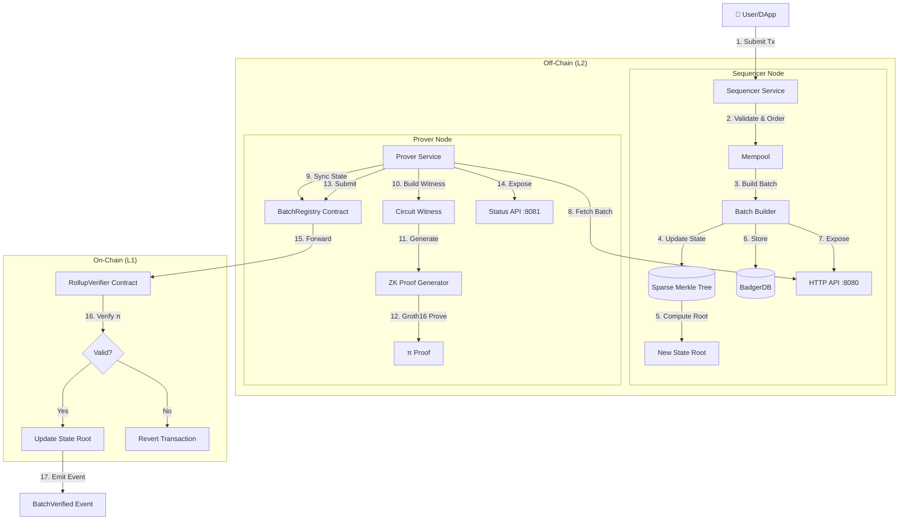
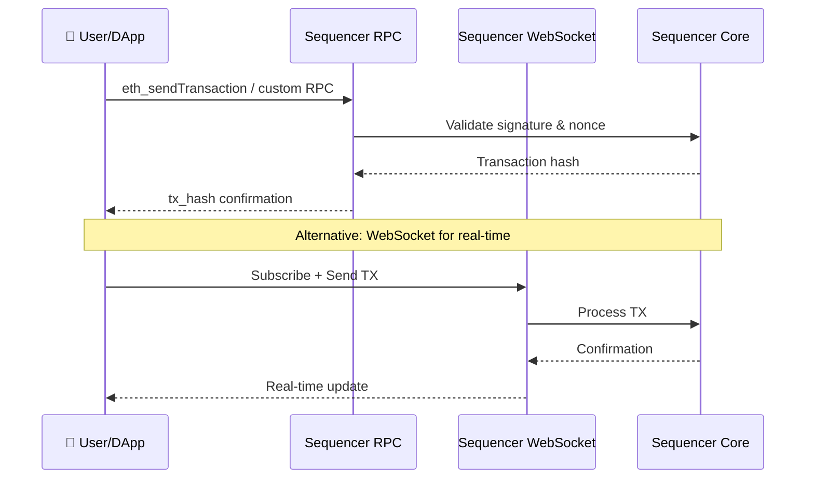
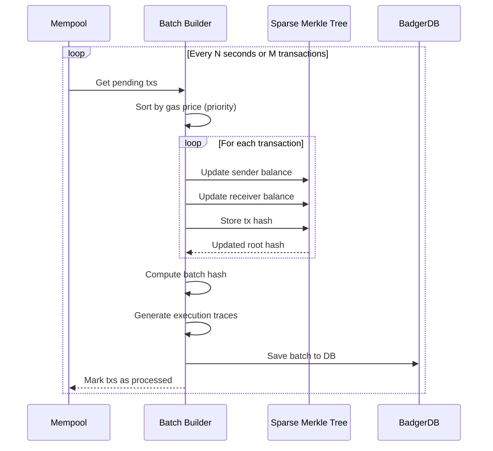
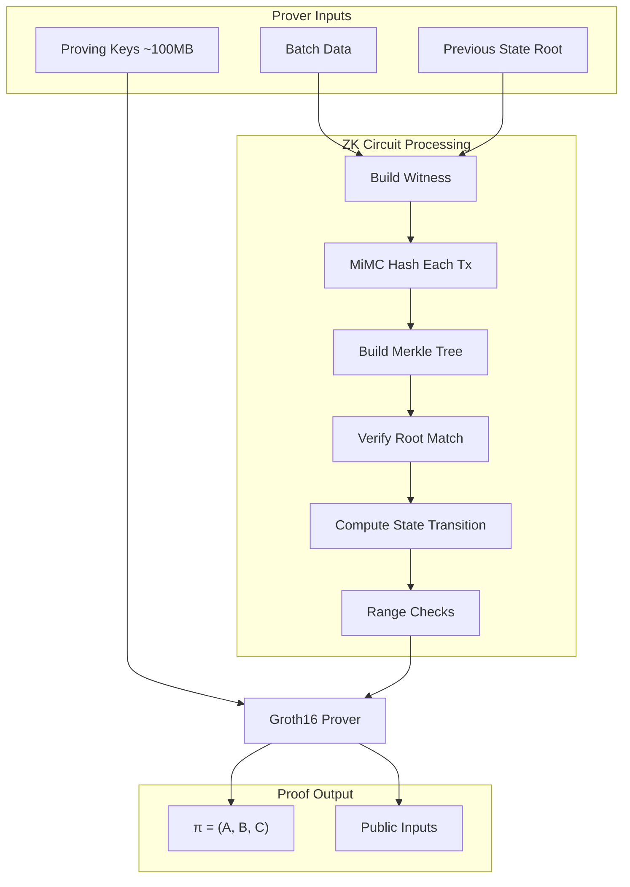
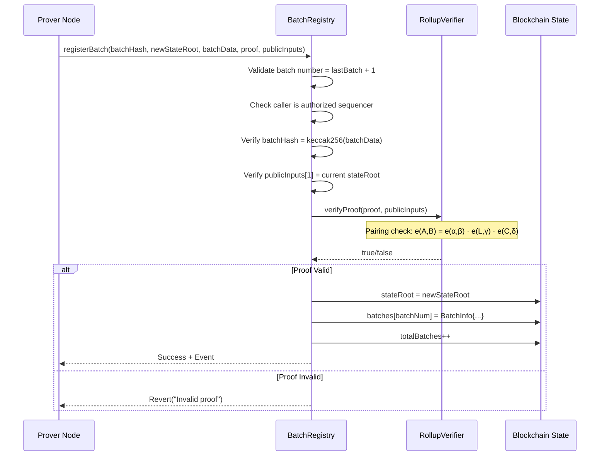
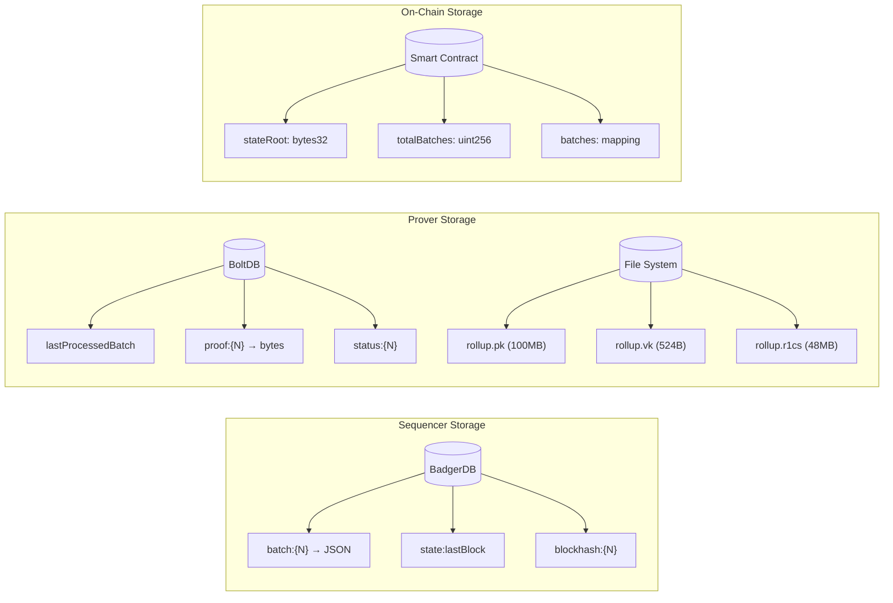
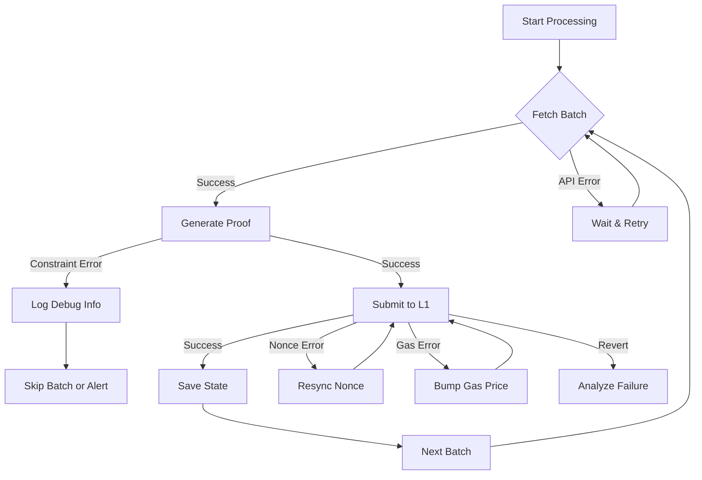
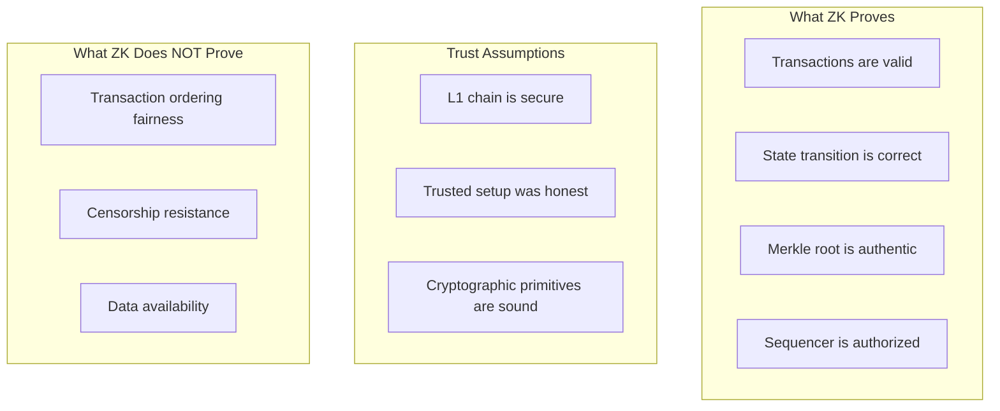

# System Data Flow

This document provides a comprehensive overview of how data flows through the Tan-ZK rollup system, from user transaction submission to final L1 verification.

---

## High-Level Architecture



---

## Detailed Data Flow Stages

### Stage 1: Transaction Submission



**What happens:**
1. User submits a transaction via JSON-RPC or WebSocket
2. Sequencer validates the signature and checks the nonce
3. Transaction is added to the mempool
4. User receives a transaction hash as confirmation

**Key data structures:**
```go
type Transaction struct {
    Hash     string      // Keccak256 hash of signed tx
    From     string      // Sender address (20 bytes)
    To       string      // Recipient address (20 bytes)  
    Value    *big.Int    // Amount in wei
    Nonce    uint64      // Sender's transaction count
    Input    []byte      // Calldata for contract calls
    GasLimit uint64      // Max gas units
    GasPrice uint64      // Price per gas unit
}
```

---

### Stage 2: Batch Building



**Batch creation process:**
1. **Transaction Collection**: Gather pending transactions from mempool
2. **Ordering**: Sort by gas price (highest first) for optimal fee extraction
3. **State Updates**: For each transaction:
   - Debit sender balance
   - Credit receiver balance
   - Record transaction in state
4. **Root Computation**: Calculate new Sparse Merkle Tree root
5. **Batch Finalization**: Create batch with metadata

**Batch data structure:**
```go
type Batch struct {
    Number       uint64         // Sequential batch number
    Hash         string         // Batch commitment hash
    OldStateRoot string         // State root before execution
    NewStateRoot string         // State root after execution
    Timestamp    int64          // Unix timestamp
    Transactions []*Transaction // Up to 128 transactions
    Traces       []*ExecutionTrace // Execution metadata
    Status       string         // "pending" | "proven" | "verified"
}
```

---

### Stage 3: Proof Generation



**Circuit constraints verified:**
| Constraint | Description |
|------------|-------------|
| Batch Root | Merkle root of transactions matches public input |
| State Transition | NewStateRoot = Hash(OldStateRoot, tx_hashes...) |
| Nonce Check | Each tx nonce ≤ 1,000,000 |
| Gas Price Check | Each tx gas price ≤ 100 Gwei |
| Gas Limit Check | Each tx gas limit ≤ 30M |
| Sequencer Check | Sequencer address ≠ 0 |
| Timestamp Check | Timestamp ≤ 2,000,000,000 |
| Batch Number Check | Batch number ≤ 1,000,000 |

**Proof structure (Groth16):**
```
Proof π consists of:
├── A ∈ G₁ (BN254 curve point)
├── B ∈ G₂ (BN254 curve point in extension field)
└── C ∈ G₁ (BN254 curve point)

Public Inputs [6]:
├── BatchRoot     (Merkle root of transactions)
├── PrevStateRoot (State before batch)
├── NewStateRoot  (State after batch)
├── BatchNumber   (Sequential identifier)
├── Timestamp     (Block timestamp)
└── SequencerAddr (Authorized sequencer)
```

---

### Stage 4: On-Chain Verification



**Contract functions:**
```solidity
// Main entry point
function registerBatch(
    bytes32 batchHash,
    bytes32 newStateRoot,
    bytes calldata batchData,
    uint256[2] calldata proofA,
    uint256[2][2] calldata proofB,
    uint256[2] calldata proofC,
    uint256[6] calldata publicInputs
) external onlySequencer

// State queries
function stateRoot() external view returns (bytes32)
function totalBatches() external view returns (uint256)
function getBatch(uint256 batchId) external view returns (BatchInfo)
```

---

## Data Storage Locations



---

## API Endpoints Summary

### Sequencer API (Port 8080)

| Endpoint | Method | Description |
|----------|--------|-------------|
| `/prover/batch/{n}` | GET | Get batch N with all transactions |
| `/prover/latest` | GET | Get the latest finalized batch |
| `/health` | GET | Service health check |
| `/metrics` | GET | Prometheus metrics |

**Example batch response:**
```json
{
  "number": 348,
  "hash": "0x7f3a91da2e7bc5b1...",
  "oldStateRoot": "0x123...",
  "newStateRoot": "0x456...",
  "timestamp": 1765460033,
  "transactions": [
    {
      "hash": "0xc3b997896815267b...",
      "from": "0x11c92eeea226a746...",
      "to": "0xd35544b9f8a9039c...",
      "value": 0,
      "nonce": 44419,
      "input": "0x79606d29..."
    }
  ]
}
```

### Prover API (Port 8081)

| Endpoint | Method | Description |
|----------|--------|-------------|
| `/status/{n}` | GET | Proof status for batch N |
| `/proof/{n}` | GET | Get proof bytes for batch N |
| `/batches/latest` | GET | Latest verified batch from L1 |
| `/batches/{n}` | GET | Batch details from L1 |

---

## Error Handling & Recovery



**Common error scenarios:**
| Error | Cause | Recovery |
|-------|-------|----------|
| Constraint not satisfied | Transaction data violates circuit rules | Check tx values, increase limits |
| State root mismatch | Local state out of sync with L1 | Re-sync from contract |
| Nonce too low | Transaction already submitted | Refresh nonce from chain |
| Insufficient gas | Gas estimation failed | Increase gas limit |
| Invalid proof | Keys don't match verifier | Regenerate keys & redeploy |

---

## Performance Characteristics

| Operation | Typical Duration | Notes |
|-----------|------------------|-------|
| Batch building | <100ms | Fast in-memory SMT updates |
| Key loading | 3-5 seconds | One-time at startup |
| Proof generation | 30-60 seconds | Depends on transaction count |
| Proof verification (local) | <100ms | Fast elliptic curve ops |
| L1 submission | 15-30 seconds | Depends on network congestion |
| L1 mining | 1-2 blocks | Chain-specific |

---

## Security Model



**Key security properties:**
- **Validity**: Only valid state transitions can produce a valid proof
- **Soundness**: It's computationally infeasible to forge a proof
- **Zero-Knowledge**: The proof reveals nothing about individual transactions
- **Succinctness**: Proof is constant size (~200 bytes) regardless of batch size
