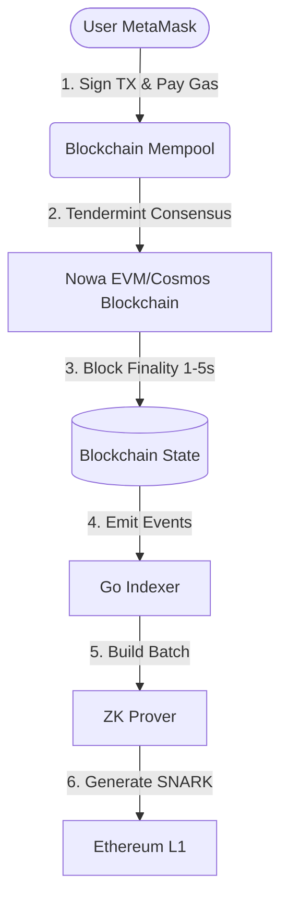
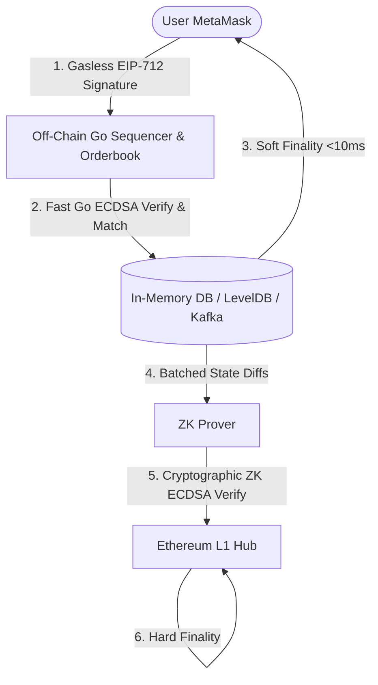

> [!NOTE]
> **Archived 2026-08-17.** This document frames the off-chain Sequencer model as the
> "Future Architecture" — that migration is now complete; the Sequencer (`sequencer/`)
> is the live execution layer. Kept here as the historical record of *why* the project
> moved off the Cosmos/indexer execution model. For the current architecture, see
> [docs/architecture/overview.md](../architecture/overview.md).

# 🔄 Nowa-ZK Architectural Evolution: Current vs Future

This document provides a highly detailed, low-level technical breakdown of our transition from a "Blockchain-Bound" execution layer to a true "Off-Chain ZK-Rollup" execution layer, including exactly how user signatures and MetaMask interactions flow.

---

## 📉 The Current Architecture (The "Block-Bound" Model)

In our initial iterations, we utilized a custom Cosmos/EVM blockchain as the core execution engine. 

### 🗺️ Text Flow Map (Current)

### 🔬 Deep Dive into Current Mechanics
1. **The User Experience (Gas & Delays):** Users connect their wallet and must sign a standard blockchain transaction. They pay a gas fee to the Cosmos network, and they wait 1-5 seconds for block inclusion.
2. **Signature Verification (Redundant):** The Cosmos validator nodes verify the ECDSA signature. Later, the ZK Prover *also* verifies the ECDSA signature. This is extremely inefficient.

---

## 📈 The Future Architecture (The "True ZK-Rollup" Model)

We replace the L2 blockchain with an ultra-fast, in-memory matching engine (The Sequencer). The user experience changes from "On-Chain Transactions" to "Off-Chain Gasless Signatures".

### 🗺️ Text Flow Map (Future Production)

### 🔬 Deep Dive into Future Mechanics

#### 1. The UX & Signature Pipeline (How Logins Work)
In the new architecture, the user rarely interacts directly with a blockchain via RPC.
*   **Onboarding (L1 Deposit):** The user connects MetaMask to your DEX website. To start trading, they submit a real Ethereum transaction calling `deposit()` on your L1 Smart Contract. They pay ETH gas *once*. The Sequencer credits their off-chain account.
*   **Trading (Gasless):** When a user wants to execute a trade, MetaMask pops up and asks them to **"Sign Message" (EIP-712)**. This is entirely off-chain. The user pays **zero gas**. 
*   **The WebSocket:** The frontend sends this raw string signature via WebSocket to the Backend Sequencer.

#### 2. The Sequencer (Instant Soft Finality)
*   **Fast Signature Verification:** When the Sequencer receives the WebSocket message, it uses standard Go cryptography (`go-ethereum/crypto`) to verify the EIP-712 signature in microseconds. If valid, the Sequencer matches the order.
*   **Soft Finality:** The engine mathematically matches the order and updates the user's balance in memory in **under 10 milliseconds**. The engine instantly replies to the user via WebSocket: *"Trade Executed"*. 

#### 3. The Prover (Absolute Hard Finality)
*   **State Diffs:** Every few seconds, the Sequencer takes all matched trades (along with their EIP-712 signatures) and passes them to the Prover.
*   **Cryptographic Verification:** The Prover does the heavy lifting. It executes the ECDSA verification *inside the ZK-SNARK circuit*. 
*   **Hard Finality:** The Prover submits the proof to Ethereum. Once Ethereum accepts it, the trades reach **Hard Finality**. 
*   **Fund Custody (Zero-Trust):** The Sequencer holds ZERO actual tokens; it only holds numbers in a database. 100% of the real tokens are locked inside the Ethereum L1 Smart Contract. The Smart Contract will only release tokens or update its state if a valid ZK Proof is provided.
*   *Security Note:* Even though the Sequencer is centralized, it **cannot fake a signature**. If the Sequencer tries to steal money by making up a trade, the ZK-SNARK circuit will attempt to cryptographically verify the signature, it will fail, and Ethereum will reject the entire batch.

---

## 🔮 The Year 2 Crossroads
After achieving massive market share, liquidity, and volume as a centralized ZK-Rollup (dYdX v3 approach), Nowa will reach a strategic crossroads in Year 2.

### Path A: The "Ultimate App"
*   **The Vision:** We remain laser-focused on being the fastest and most secure DEX in the world.
*   **The Tech:** We never build a Layer 1 blockchain. We simply deploy our Decentralized Sequencer Network (Phase 12) to distribute the ordering of trades among `$NOWA` token stakers.
*   **The Result:** Uncompromising speed, pure focus on trading, and zero technical bloat. (The Loopring / Uniswap philosophy).

### Path B: The "Ecosystem Hub"
*   **The Vision:** We leverage our massive DEX userbase to bootstrap an entirely new Layer 1 or Layer 2 smart contract platform.
*   **The Tech:** We use Ignite CLI (Cosmos) or the OP Stack to build **Nowa Chain**. The DEX becomes the flagship application on this new chain, and we invite third-party developers to build lending protocols, NFTs, and memecoins on top of it.
*   **The Result:** `$NOWA` becomes a massive ecosystem gas token (like BNB or ETH). (The Binance / dYdX v4 / Coinbase Base philosophy).
