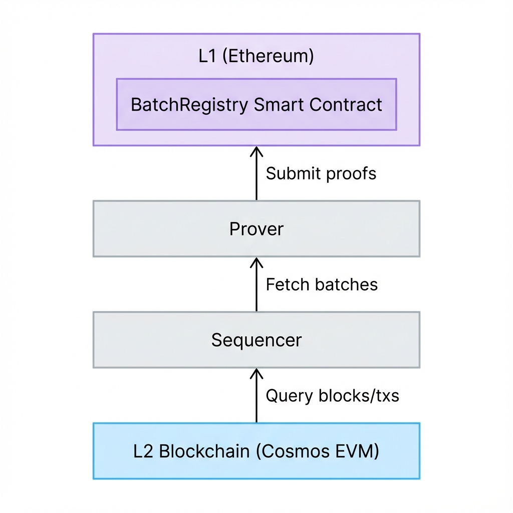

# Tan-ZK Litepaper

## Abstract
Tan-ZK is a cutting-edge Layer 2 scaling solution leveraging Zero-Knowledge (ZK) proofs to ensure security, scalability, and fast finality. Built on a modular architecture involving Ethereum as Layer 1 and a Cosmos SDK-based EVM as Layer 2, Tan-ZK offers a high-performance execution environment for decentralized applications. This litepaper outlines the core components, architectural flow, and technical specifications of the network.

---

## 1. Introduction
The demand for scalable blockchain solutions has never been higher. High gas fees and network congestion on Ethereum have driven the adoption of Layer 2 rollups. Tan-ZK introduces a hybrid approach, combining the robust security of Ethereum with the interoperability and speed of the Cosmos ecosystem. By utilizing Groth16 ZK proofs, Tan-ZK ensures that state transitions are mathematically verifiable on-chain without exposing transaction data, maintaining both privacy and efficiency.

## 2. Architecture Overview

The Tan-ZK architecture consists of four primary layers that interact seamlessly to provide a secure and fast transaction experience.

### 2.1 L1 (Ethereum)
The foundation of Tan-ZK's security model lies on the Ethereum mainnet.
*   **BatchRegistry Smart Contract**: This constitutes the source of truth for the L2 state on L1. It serves three critical functions:
    *   **Storage**: Maintains batch commitments and state roots.
    *   **Verification**: Verifies ZK proofs submitted by the Prover.
    *   **State Management**: Updates and finalizes the L2 state based on valid proofs.

### 2.2 Prover
The Prover is the computational engine responsible for generating validity proofs.
*   **Workflow**:
    1.  Fetches transaction batches from the Sequencer.
    2.  Computes Groth16 Zero-Knowledge proofs, compressing 128 transactions into a succinct proof.
    3.  Submits these proofs along with minimal metadata (transaction hashes, approx. 4KB per batch) to the BatchRegistry on L1.
*   **Efficiency**: By off-loading computation from L1 and submitting only proofs and essential data, the Prover significantly reduces gas costs.

### 2.3 Sequencer
The Sequencer acts as the coordinator between the execution layer and the proving layer.
*   **Roles**:
    *   **Indexing**: continuously indexes block and transaction data from the L2 Blockchain.
    *   **Batching**: Groups transactions into efficient batches (fixed at 128 txs per batch) for the Prover.
    *   **Data Availability**: Provides an API for the Prover to retrieve necessary data.
    *   **Maintenance**: Performs automated cleanup, removing proven batches every 5 minutes to optimize storage.

### 2.4 L2 Blockchain (Cosmos EVM)
The user-facing execution layer is built using the Cosmos SDK with EVM compatibility.
*   **Features**:
    *   **EVM Compatibility**: Developers can deploy existing Ethereum smart contracts without modification.
    *   **Performance**: Achieves fast finality with a block time of approximately 1 second.
    *   **Interoperability**: Being part of the Cosmos ecosystem opens doors for IBC (Inter-Blockchain Communication) integrations.

---

## 3. Data Flow Cycle

1.  **Execution**: Users submit transactions to the L2 Blockchain. Blocks are produced rapidly (~1s).
2.  **Sequencing**: The Sequencer queries these new blocks, extracts transactions, and accumulates them into batches.
3.  **Proving**: The Prover requests a batch from the Sequencer, generates a ZK proof confirming the validity of the state transition.
4.  **Finalization**: The Prover submits the proof to the BatchRegistry on Ethereum. The contract verifies the proof, and upon success, the L2 state is finalized on L1.

## 4. Technical Specifications
*   **Proof System**: Groth16 (favored for small proof sizes and fast verification).
*   **Batch Size**: 128 Transactions.
*   **L1 Storage footprint**: ~4KB per batch (Tx hashes only).
*   **L2 Consensus**: CometBFT (Tendermint).
*   **Block Time**: ~1 Second.

## 5. Conclusion
Tan-ZK represents a significant step forward in modular blockchain architectures. By decoupling data availability, execution, and proving, it achieves a balanced optimization of cost, speed, and security. As the network matures, further optimizations in prover performance and batch sizes are anticipated to drive even greater scalability.
